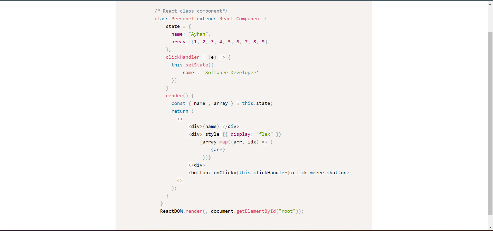

# Prism.js Tutorial 
### Hello friends everyone wanted to write web color codes. Then problem solved, let me introduce you to primjs. primjs briefly brings the codes that we will present on html pages for promotional or informational purposes in a colorful format. You can review the required usage in my repo. Thanks everyone in advance and you can download and install it with the link I left here. [link](https://prismjs.com/download.html#themes=prism-dark&languages=markup+css+clike+javascript+c+csharp+cpp+git+java)

```html
   <pre style="border-radius: 20px;">
        <code class="language-js">
            /* React class component*/
            class Personel extends React.Component {
                state = {
                  name: "Ayhan",
                  array: [1, 2, 3, 4, 5, 6, 7, 8, 9],
                };
                clickHandler = (e) => {
                  this.setState({
                      name : 'Software Developer'
                  })
                }
                render() {    
                  const { name , array } = this.state;
                  return (
                    &lt;&gt;
                        &lt;div&gt;{name} &lt;/div&gt;
                        &lt;div&gt; style={{ display: "flex" }}
                            {array.map((arr, idx) => (
                                <div key={idx}>{arr}</div>
                             ))}
                        &lt;/div&gt;
                        &lt;button&gt; onClick={this.clickHandler}>click meeee &lt;button&gt;
                    &lt;&gt;
                  );
                }
              }
              ReactDOM.render(<Personel />, document.getElementById("root"));
        </code>
    </pre>
```
### app - view

